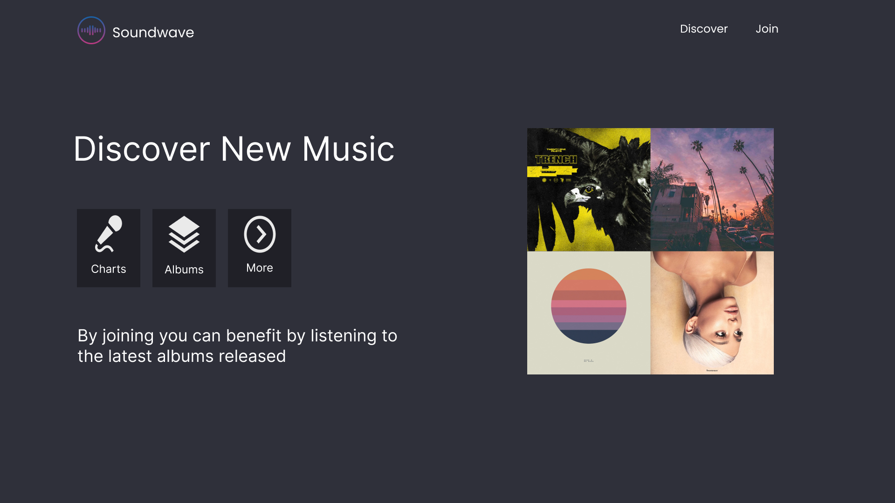

# Figma-Music-Web-Application-Design
This is a figma design practice web application. The Soundwave web Application consists of three pages as follows:
 
- **Home Page:** which consists of buttons and Captivating quotes and routes to the Signup page and Discover page.  
  
- **Discover Page:** where this page routes to charts, albums and more.  
  
- **Signup Page:** where the user can signup by name, email and password.  
  
  
 

## Logo
Also the logo is designed using Figma  
                                       

## Live Demo
You can navigate to  this link to try it

[Live Demo](https://www.figma.com/proto/UXjQVAg3ZYFbSQSg6BJil2/Untitled?type=design&node-id=3-2&t=jiCfkaXghfTgwhb9-1&scaling=contain&page-id=0%3A1&starting-point-node-id=3%3A2&mode=design).
